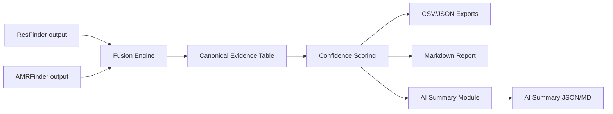

# AMR-Fusion-Lab

[](https://github.com/AKADevelopers/AMR-Fusion-Lab/actions/workflows/ci.yml)


Unified **AMR evidence fusion + interpretation toolkit** for microbiology and public-health workflows.

## Why this project
Most AMR tools produce raw hit tables. Labs still need manual interpretation.

**AMR-Fusion-Lab** merges outputs from multiple AMR tools into one schema, adds confidence scoring, and generates reporting outputs that are easier to review and share.

## Current release (v0.2)
- Parse outputs from:
  - ResFinder (TSV/CSV)
  - AMRFinder-style exports (TSV/CSV)
  - RGI exports (TSV/CSV)
- Normalize into canonical schema
- Drug class ontology harmonization (cross-tool standardization)
- Rule-based confidence scoring (transparent + auditable)
- Weighted consensus scoring with tool reliability priors
- Export outputs:
  - fused CSV/JSON
  - gene summary CSV/JSON
  - disagreement table CSV
  - markdown report
- Optional AI interpretation summary (OpenAI-compatible)

## Quick start
```bash
python -m venv .venv
. .venv/Scripts/activate  # Windows PowerShell/cmd users
pip install -e .
amr-fusion --help
```

## Docker quick start
Build image:
```bash
docker build -t amr-fusion-lab:0.2 .
```

Run with mounted workspace data:
```bash
docker run --rm -v ${PWD}:/data -w /data amr-fusion-lab:0.2 run \
  --resfinder examples/resfinder_sample.tsv \
  --amrfinder examples/amrfinder_sample.tsv \
  --rgi examples/rgi_sample.tsv \
  --sample-id SAMPLE_001 \
  --outdir outputs/SAMPLE_001
```

## Example run
```bash
amr-fusion \
  --resfinder examples/resfinder_sample.tsv \
  --amrfinder examples/amrfinder_sample.tsv \
  --rgi examples/rgi_sample.tsv \
  --sample-id SAMPLE_001 \
  --outdir outputs/SAMPLE_001
```

Generated files:
- `outputs/SAMPLE_001/SAMPLE_001.amr_fused.csv`
- `outputs/SAMPLE_001/SAMPLE_001.amr_fused.json`
- `outputs/SAMPLE_001/SAMPLE_001.gene_summary.csv`
- `outputs/SAMPLE_001/SAMPLE_001.gene_summary.json`
- `outputs/SAMPLE_001/SAMPLE_001.disagreements.csv`
- `outputs/SAMPLE_001/SAMPLE_001.report.md`
- `outputs/SAMPLE_001/SAMPLE_001.report.html`
- `outputs/SAMPLE_001/SAMPLE_001.run_manifest.json`

## AI summary mode (professional interpretation layer)
You can run multiple providers:

### A) OpenAI-compatible (OpenAI / OpenRouter / Groq / Together / local vLLM)
```bash
set OPENAI_API_KEY=YOUR_KEY
# optional: set OPENAI_API_BASE=https://openrouter.ai/api/v1

amr-fusion \
  --resfinder examples/resfinder_sample.tsv \
  --amrfinder examples/amrfinder_sample.tsv \
  --sample-id SAMPLE_001 \
  --outdir outputs/SAMPLE_001 \
  --ai-enable \
  --ai-provider openai_compatible \
  --ai-model gpt-4o-mini
```

### B) Claude (Anthropic)
```bash
set ANTHROPIC_API_KEY=YOUR_KEY

amr-fusion \
  --resfinder examples/resfinder_sample.tsv \
  --amrfinder examples/amrfinder_sample.tsv \
  --sample-id SAMPLE_001 \
  --outdir outputs/SAMPLE_001 \
  --ai-enable \
  --ai-provider anthropic \
  --ai-model claude-3-5-sonnet-latest
```

### C) Free/Open-source local model via Ollama
```bash
# first run your local model, e.g. llama3.1
amr-fusion \
  --resfinder examples/resfinder_sample.tsv \
  --amrfinder examples/amrfinder_sample.tsv \
  --sample-id SAMPLE_001 \
  --outdir outputs/SAMPLE_001 \
  --ai-enable \
  --ai-provider ollama \
  --ai-model llama3.1
```

Additional AI files:
- `outputs/SAMPLE_001/SAMPLE_001.ai_summary.json`
- `outputs/SAMPLE_001/SAMPLE_001.ai_summary.md`

### Optional quality gates
```bash
amr-fusion \
  --resfinder examples/resfinder_sample.tsv \
  --amrfinder examples/amrfinder_sample.tsv \
  --sample-id SAMPLE_001 \
  --outdir outputs/SAMPLE_001 \
  --min-identity 90 \
  --min-coverage 70 \
  --deduplicate
```

### Strict validation mode
Use strict mode to fail the run when validation warnings are present:
```bash
amr-fusion \
  --resfinder examples/resfinder_sample.tsv \
  --sample-id SAMPLE_001 \
  --outdir outputs/SAMPLE_001 \
  --strict-validation
```

## Architecture (Tool v0.1)


## What makes this useful
- Multi-tool fusion in one place
- Confidence tiers with explicit rationale
- Weighted consensus tiers for gene-level decision support
- Lab/public-health friendly reporting
- Reproducible and auditable output files

## Roadmap (next)
- [x] RGI parser
- [x] Disagreement matrix (tool-vs-tool conflicts)
- [x] Drug class ontology harmonization
- [x] HTML report generator
- [ ] PDF report generator
- [x] AI narrative summary (strict JSON guardrails)
- [ ] Docker image

## Contributing
PRs and issues are welcome. For major changes, open an issue first with:
- use-case
- expected output
- sample input format

## Disclaimer
This project is a research/decision-support utility and not a standalone clinical diagnostic device.

