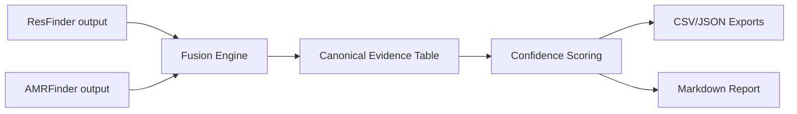

# AMR-Fusion-Lab

[](https://github.com/AKADevelopers/AMR-Fusion-Lab/actions/workflows/ci.yml)


Unified **AMR evidence fusion + interpretation toolkit** for microbiology and public-health workflows.

## Why this project
Most AMR tools produce raw hit tables. Labs still need manual interpretation.

**AMR-Fusion-Lab** merges outputs from multiple AMR tools into one schema, adds confidence scoring, and generates reporting outputs that are easier to review and share.

## Current MVP (v0.1)
- Parse outputs from:
  - ResFinder (TSV/CSV)
  - AMRFinder-style exports (TSV/CSV)
- Normalize into canonical schema
- Rule-based confidence scoring (transparent + auditable)
- Export outputs:
  - fused CSV
  - fused JSON
  - markdown report

## Quick start
```bash
python -m venv .venv
. .venv/Scripts/activate  # Windows PowerShell/cmd users
pip install -e .
amr-fusion --help
```

## Example run
```bash
amr-fusion run \
  --resfinder examples/resfinder_sample.tsv \
  --amrfinder examples/amrfinder_sample.tsv \
  --sample-id SAMPLE_001 \
  --outdir outputs/SAMPLE_001
```

Generated files:
- `outputs/SAMPLE_001/SAMPLE_001.amr_fused.csv`
- `outputs/SAMPLE_001/SAMPLE_001.amr_fused.json`
- `outputs/SAMPLE_001/SAMPLE_001.report.md`

## Architecture (MVP)


## What makes this useful
- Multi-tool fusion in one place
- Confidence tiers with explicit rationale
- Lab/public-health friendly reporting
- Reproducible and auditable output files

## Roadmap (next)
- [ ] RGI parser
- [ ] Disagreement matrix (tool-vs-tool conflicts)
- [ ] Drug class ontology harmonization
- [ ] HTML/PDF report generator
- [ ] AI narrative summary (strict JSON guardrails)
- [ ] Docker image

## Contributing
PRs and issues are welcome. For major changes, open an issue first with:
- use-case
- expected output
- sample input format

## Disclaimer
This project is a research/decision-support utility and not a standalone clinical diagnostic device.
